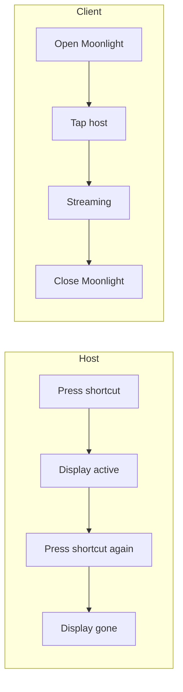
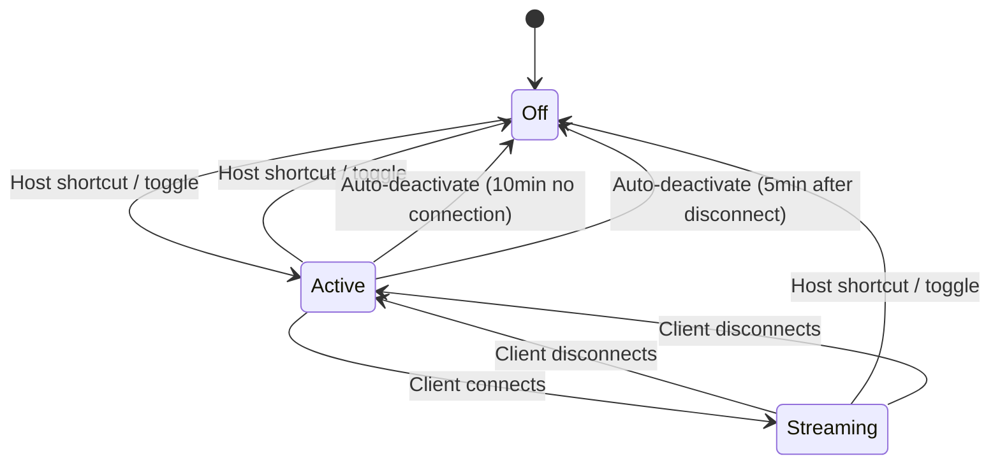

# Extended Desktop Workflow

## Interaction Surface

Using a tablet or second computer as an extended display. Both the host and the client experience should feel like opening an app — one deliberate gesture per device, no configuration, no orchestration.

## Reference: Duet Display

Duet sets the bar for this interaction. Its happy path:

1. Host has Duet running in the background (installed once, launches at login).
2. User opens Duet on iPad. iPad becomes a second display. Immediately.
3. User closes Duet on iPad. iPad stops being a second display.

No resolution selection. No host selection. No display arrangement (after the first time). No teardown commands. The app IS the display.

Our stack (Sunshine + Moonlight + BetterDisplay/xrandr) is more powerful than Duet (hardware-accelerated, cross-platform, laptop-to-laptop, no subscription) but the interaction is currently worse. This design closes that gap.

## User Flow

### Daily use

**Host:** Press a keyboard shortcut (or Raycast command). The extended display appears. Press it again when done. That's it.

**Tablet:** Open Moonlight. Tap the host. Extended desktop. Close Moonlight when done.

**Laptop as client:** Open the "Extend Display" app/shortcut. Extended desktop. Close it when done.



Both sides: **one gesture to start, one gesture to stop.** No commands, no menus, no decisions.

### What makes this Duet-simple

| Friction point | Duet | Our design |
|---------------|------|------------|
| Host activation | Invisible (always on) | One keyboard shortcut — toggles on/off |
| Client activation | Open app → instant display | Open Moonlight → tap host (one extra tap*) |
| Resolution | Auto-detected from device | Auto-loaded from device profile — user never types a resolution |
| Display position | Set once, remembered | Set once, remembered (macOS) / set in profile (Linux) |
| Teardown | Close app on client | Either side: host shortcut OR close Moonlight — both work independently |
| Pairing | Automatic (USB) or account-based (Wi-Fi) | Once per device via `extend-display pair` |

*Moonlight is a general-purpose streaming client, so it shows a host list. With only one paired host, it's effectively a single tap to start. This is the one place we can't match Duet exactly — but it's still two taps total (open app + tap host).

## Host-Side Experience

### The keyboard shortcut

A single hotkey (configured via Raycast on macOS, or the window manager on Linux) toggles the extended display:

**First press — activate:**
1. Creates the virtual display at the primary device profile's resolution.
2. Ensures Sunshine is running and streaming.
3. Shows a brief notification: "Extended display ready — open Moonlight on your device."
4. On macOS: a menu bar indicator appears (or updates) showing the display is active.

**Second press — deactivate:**
1. Disconnects any active Moonlight stream via Sunshine's API.
2. Removes the virtual display.
3. Windows snap back to primary monitor.
4. Notification: "Extended display off."

Behind the scenes, this is `extend-display toggle` — but the user doesn't type it. It's bound to a key.

### Menu bar / systray indicator (macOS)

When the extended display is active, a menu bar icon shows state at a glance:

| Icon state | Meaning |
|-----------|---------|
| Filled | Streaming (a client is connected) |
| Outline | Active but no client connected |
| Hidden | Display not active (default state) |

Clicking the indicator opens a minimal dropdown:
- Current state ("Streaming to Cristos's iPad" or "Waiting for connection")
- "Switch device" → submenu of device profiles
- "Stop" → deactivates the display
- "Recall windows" → moves windows from virtual display to primary

This gives visual feedback and a mouse-driven alternative to the keyboard shortcut — useful when the user can't remember the hotkey.

### Auto-deactivation

If the display is active but no client has connected for 10 minutes, the host automatically deactivates and sends a notification: "Extended display auto-stopped — no connection." This prevents orphaned displays when the user activates by accident or changes their mind.

If a client was streaming and disconnects, the display stays active for 5 minutes (in case of a Wi-Fi hiccup or brief interruption), then auto-deactivates.

## Client-Side Experience

### Tablet (iPad / Android)

1. Open Moonlight.
2. Paired hosts appear. Tap the host name.
3. The extended desktop streams immediately — no app selection (Sunshine is configured to auto-launch Desktop).
4. Close Moonlight (or switch away from it) when done.

That's two taps. If only one host is paired, the host list has exactly one item — no decision to make.

### Laptop as client

Ansible provisions a one-click shortcut:

- **macOS:** An Automator app in `/Applications/` named "Extend from [hostname]" — double-click or Spotlight/Raycast launch.
- **Linux:** A `.desktop` file in `~/.local/share/applications/` — appears in the app launcher.

The shortcut runs `moonlight stream <hostname> Desktop`, which opens directly into the stream — no host list, no app selection. Closing the Moonlight window ends the session.

### Reversing roles (laptop-to-laptop)

Every provisioned machine is both a host and a client. To use Machine B's display from Machine A:

1. On Machine B (host): press the keyboard shortcut.
2. On Machine A (client): open the "Extend from Machine-B" shortcut.

Same two-gesture pattern. No reconfiguration.

## Device Profiles

Resolution and position are decided once, not per-session. Stored in `~/.config/extend-display/devices.yml`:

```yaml
primary: ipad

devices:
  ipad:
    resolution: 2048x1536
    position: right-of

  tab-s:
    resolution: 2560x1600
    position: right-of

  macbook:
    resolution: 2560x1600
    position: left-of
```

`primary` is the default device. The keyboard shortcut creates a display at the primary device's resolution. To use a different device, the user either:
- Uses the menu bar indicator → "Switch device"
- Or: `extend-display switch tab-s` from the terminal

Profiles are provisioned by Ansible with the user's actual devices.

## First-Time Setup

These happen once and are never repeated:

| Step | When | How |
|------|------|-----|
| **Ansible provisions the host** | Once per machine | `ansible-playbook` runs the display role — installs BetterDisplay/xrandr tools, Sunshine, Moonlight, creates device profiles, binds the keyboard shortcut, creates client shortcuts |
| **Pair each client device** | Once per client | `extend-display pair` in the terminal — enter the PIN Moonlight shows |
| **Arrange the display (macOS)** | Once per resolution | System Settings > Displays > Arrange after first activation. macOS remembers the position. |

After these three one-time steps, the daily workflow is purely gesture-based.

## Screen States



| State | Host | Client |
|-------|------|--------|
| **Off** | No virtual display. Sunshine running in background. Menu bar indicator hidden. | Moonlight shows host as available (Sunshine is reachable) but streaming hasn't started. |
| **Active** | Virtual display exists. Menu bar indicator shows outline. Windows can be dragged there. | Same as Off from the client's perspective — ready to connect. |
| **Streaming** | Menu bar indicator filled. `extend-display status` shows client name. | Moonlight shows extended desktop content in real-time. |

## Edge Cases

| Scenario | How the design handles it |
|----------|--------------------------|
| **User activates host but forgets to connect** | Auto-deactivate after 10 minutes with notification. |
| **Client disconnects unexpectedly (Wi-Fi, sleep)** | Display stays active for 5 minutes. Moonlight reconnects automatically if the client comes back. After 5 minutes, auto-deactivate. |
| **Windows stranded on virtual display after deactivation** | Deactivation moves all windows back to primary (same as `extend-display recall`). No orphaned windows. |
| **Different device than usual** | Menu bar indicator → "Switch device" or `extend-display switch tab-s`. |
| **Sunshine not running** | Activation starts it automatically and waits for readiness. |
| **Multiple clients** | Sunshine serves one client at a time. Second client sees "Host is busy." |
| **User doesn't want a keyboard shortcut** | Menu bar indicator provides mouse-driven control. CLI (`extend-display toggle`) is available for scripting. |

## The `extend-display` CLI

The CLI is the automation layer beneath the UX. Users don't type these commands in daily use — they're bound to shortcuts, indicators, and Ansible.

| Command | Purpose | Who uses it |
|---------|---------|-------------|
| `toggle` | Activate or deactivate the extended display | Bound to keyboard shortcut |
| `pair` | Pair a new Moonlight client | User, once per client device |
| `switch <device>` | Change to a different device profile | Menu bar indicator or terminal |
| `recall` | Move all windows from virtual display to primary | Deactivation does this automatically; also available standalone |
| `status` | Show display state + active connections | Diagnostics / scripting |
| `setup` | (Re)create configuration from device profiles | Ansible / recovery |

## Design Decisions

1. **Keyboard shortcut as the primary host interaction.** A hotkey is "opening an app" without the app — one gesture, instant, reversible. It matches the muscle memory of toggling display modes on a laptop (Fn+F7). The menu bar indicator and CLI exist as secondary interfaces.
2. **Toggle semantics over start/stop.** One shortcut, two states. Press to activate, press to deactivate. No "which command do I need?" decision. Mirrors how screen sharing, Do Not Disturb, and other system toggles work.
3. **Auto-deactivation over orphan timers.** The display is not permanent infrastructure — it's an intentionally activated feature. If nobody uses it, it turns itself off. This is closer to how Duet behaves (display goes away when the client disconnects) and prevents phantom displays.
4. **Deactivation recalls windows automatically.** The "windows stranded on an invisible display" problem can't happen. Deactivation (whether manual, auto, or client-triggered) always moves windows back to primary first.
5. **Sunshine auto-launches Desktop, hides game entries.** Eliminates the "select an app" step in Moonlight. Reduces the client-side interaction from 3 taps to 2 taps.
6. **One-click shortcuts for laptop clients.** Bakes the host and app into the shortcut so the Moonlight host list and app list are bypassed entirely. Laptop-to-laptop extension becomes "click an icon."
7. **Device profiles with a primary device.** The common case (one user, one tablet) needs zero configuration at activation time. Switching devices is supported but treated as the exception.
8. **Unified cross-platform CLI.** `extend-display` works on macOS and Linux, dispatching to `betterdisplaycli` or xrandr. The user (and the keyboard shortcut) use one interface.
9. **Sunshine+Moonlight over Duet/VNC.** HW-accelerated encoding (< 16ms) at zero subscription cost, cross-platform, laptop-to-laptop capable. The interaction gap with Duet is now closed — the technical advantage remains.

## Assets

- [`extend-display`](../../../../shared/roles/display/files/extend-display) — Current Linux-only xrandr wrapper. To be refactored into the unified cross-platform CLI described above.

## Lifecycle

| Phase | Date | Commit | Notes |
|-------|------|--------|-------|
| Approved | 2026-03-12 | — | Created directly in Approved; user approved during SPIKE-013 review |
