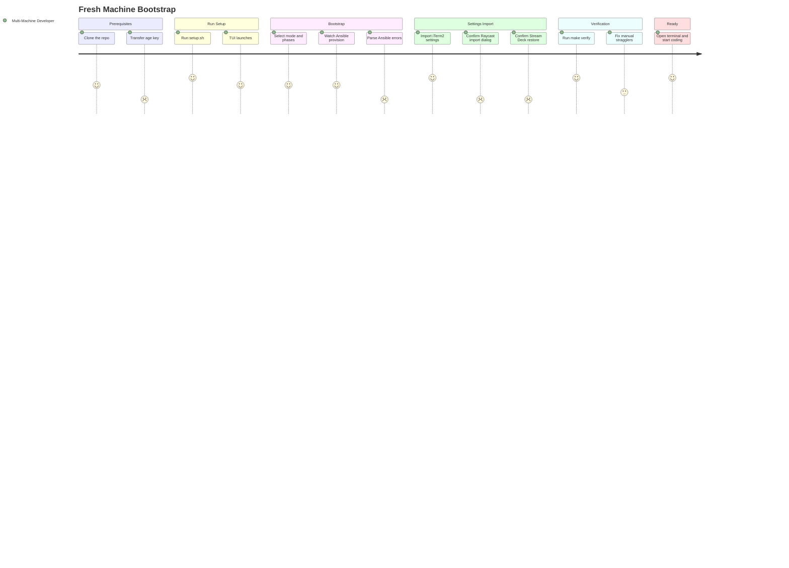

# JOURNEY-001: Fresh Machine Bootstrap

## Persona

[The Multi-Machine Developer](../../persona/(PERSONA-001)-The-Multi-Machine-Developer/(PERSONA-001)-The-Multi-Machine-Developer.md) — has just unboxed a new machine (or completed a fresh OS install) and needs to reach a fully configured development environment.

## Goal

Go from a stock macOS or Linux install to a fully provisioned workstation — tools installed, dotfiles deployed, secrets decrypted, keybindings active, app settings restored — with minimal manual intervention.

## Steps / Stages

### 1. Prerequisites

The developer has a fresh OS install and a terminal. They need to get the repo onto the machine and obtain their age decryption key.

- **Clone the repo** — `git clone` or curl the setup.sh one-liner. Straightforward on macOS (git ships with Xcode CLT) and Linux (git via apt).
- **Transfer the age key** — The private key (`~/.config/sops/age/keys.txt`) must be transferred from another machine. Options: `make key-send` / `make key-receive` (Magic Wormhole), `make key-export` / `make key-import` (passphrase-encrypted blob), or manual SCP.

**Pain point: Age key transfer.** Magic Wormhole requires the other machine to be online simultaneously. The passphrase-encrypted export requires remembering the passphrase. Manual SCP requires SSH access to the source machine. All three options add friction to what should be a "just run one command" experience.

### 2. Run setup.sh

The developer runs `./setup.sh`. The script auto-detects the platform, installs minimal prerequisites (python3, uv, sops, age), and launches the Textual TUI.

- **Automatic prerequisite installation** — Works well. On macOS, triggers Xcode CLT install if needed (one dialog click). On Linux, runs apt.
- **TUI launches** — The welcome screen detects the repo is personalized and shows the full menu.

### 3. Bootstrap mode selection

The TUI presents three bootstrap modes. For a fresh machine, the developer selects "Fresh install."

- **Mode selection** — Clear choices: fresh install, new account on existing system, existing account migration.
- **Phase selection** — Checkboxes for phases 0-8. All selected by default for fresh installs.
- **Role selection** — Per-phase role checkboxes with sensible defaults. Can deselect individual tools.

### 4. Ansible provisioning

The developer enters their sudo password. Ansible runs through the selected phases. Live output streams in the TUI with an elapsed timer.

- **Watch output scroll** — Satisfying to see tools installing. The elapsed timer sets expectations.
- **Wait for completion** — Phases 0-2 are the slowest (system packages, Homebrew on macOS). Typically 8-12 minutes total unattended.
- **Handle errors** — Occasional failures on network-dependent steps (Homebrew timeouts, GitHub rate limits). The developer can re-run the same phase to retry.

**Pain point: Opaque Ansible failures.** When a task fails mid-phase, the error message is Ansible-formatted and can be hard to parse. The developer must scroll back through output to find the failing task and understand what went wrong.

### 5. Settings import

After Ansible completes, the developer imports app-specific settings (iTerm2, Raycast, Stream Deck) via the TUI's Import Settings screen.

- **Select imports** — Checklist of available settings. All selected by default.
- **iTerm2** — Non-interactive, points preferences at the stow-managed plist. Instant.
- **Raycast** — Decrypts age-encrypted `.rayconfig`, opens the Raycast import dialog. The developer confirms in the Raycast UI.
- **Stream Deck** — Decrypts age-encrypted backup, opens the Stream Deck restore dialog. The developer confirms in the Stream Deck app.

**Pain point: Interactive import dialogs.** Raycast and Stream Deck imports require switching to the app, clicking through a confirmation dialog, and returning to the TUI. This breaks the "hands-off" flow.

### 6. Post-install verification

The developer runs `make verify` (or uses the TUI's Verify screen) to confirm everything installed correctly.

- **Green checkmarks** — Each role reports installed/version/status. The developer scans for failures.
- **Fix stragglers** — Occasionally a tool needs manual intervention (MAS sign-in for App Store apps, Setapp activation, Accessibility permissions on macOS).

### 7. Ready to work

The developer opens their terminal, sees their familiar prompt, keybindings work, git is configured with signing, and they can start coding.

## Pain points summary

| Stage | Pain point | Severity | Owning artifact | Opportunity |
|-------|-----------|----------|-----------------|-------------|
| Prerequisites | Age key transfer requires coordination with another machine | Frustrated | STORY-007 (EPIC-004) | 1Password CLI retrieval after Phase 1 installs `op` |
| Bootstrap | Ansible error messages are hard to parse in the TUI | Frustrated | STORY-008 (EPIC-004) | Post-run failed-tasks summary panel with retry |
| Settings Import | Raycast and Stream Deck require interactive confirmation dialogs | Frustrated | STORY-006 (EPIC-003) | Headless import via CLI tools or plist manipulation |

## Opportunities

- **One fewer manual step:** If the age key could be retrieved from 1Password (which is installed in Phase 1), the key transfer step could be eliminated for users who store their key there.
- **Error UX:** A post-run summary panel showing only failed tasks (with retry buttons) would dramatically improve the error-handling experience.
- **Headless settings import:** If iTerm2's approach (plist manipulation) could be extended to Raycast and Stream Deck, the entire bootstrap could be fully unattended.

### Lifecycle

| Phase | Date | Commit | Notes |
|-------|------|--------|-------|
| Validated | 2026-02-27 | cf207f8 | Based on actual bootstrap runs across macOS and Linux |
