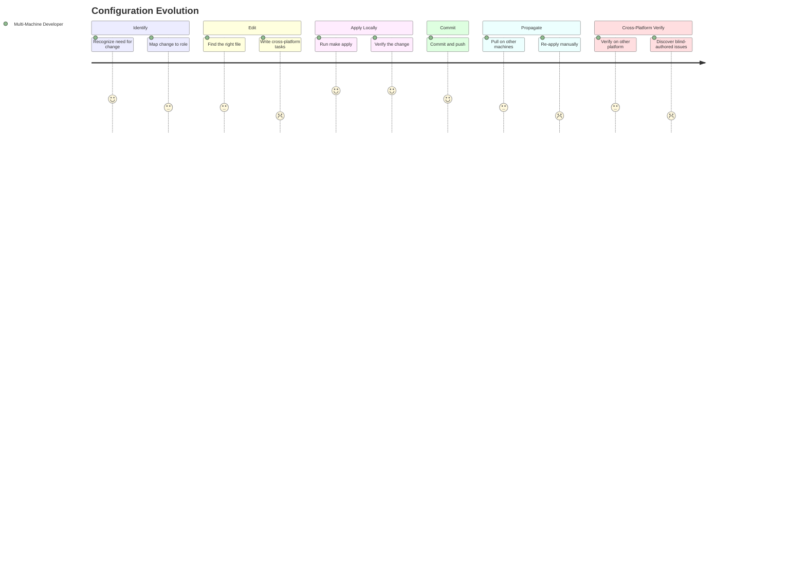

# JOURNEY-002: Configuration Evolution

## Persona

[The Multi-Machine Developer](../../persona/(PERSONA-001)-The-Multi-Machine-Developer/(PERSONA-001)-The-Multi-Machine-Developer.md) — working on an already-bootstrapped machine and wants to add a new tool, change a keybinding, or update a configuration.

## Goal

Evolve the workstation configuration iteratively — add a tool, tweak a dotfile, update a version pin — and propagate the change to all machines through the repo.

## Steps / Stages

### 1. Identify the change

The developer discovers a new tool they want, or realizes a config needs tweaking. This usually happens mid-workflow: "I wish I had `jq` installed" or "this keybinding conflicts with something."

- **Recognize the need** — Happens organically during development work. The developer mentally maps the change to the IaC system: "Which role does this belong to?"

### 2. Edit the configuration

The developer modifies role defaults, task files, or dotfiles in the repo.

- **Find the right file** — For a new tool: find or create a role in `shared/roles/`. For a dotfile change: edit the appropriate stow package. For a secret: `make edit-secrets-shared`.
- **Follow the pattern** — The documented procedure (`docs/adding-tools.md`) covers role creation, platform dispatch, tag naming, and verification setup.
- **Handle cross-platform** — Adding a tool means writing both `darwin.yml` and `debian.yml` task includes. The developer must know the install mechanism for both platforms.

**Pain point: Cross-platform authoring burden.** Every tool addition requires knowing how to install it on *both* platforms. If the developer only has one platform in front of them, the other platform's tasks are written blind and tested later.

### 3. Apply locally

The developer applies the change to the current machine.

- **Run `make apply ROLE=<name>`** — Fast, targeted application. Only the affected role runs.
- **Verify** — `make verify-role ROLE=<name>` confirms the tool is installed and the config is correct.
- **Iterate** — If something is wrong, edit and re-apply. The feedback loop is tight: edit → apply → verify in under a minute for most roles.

### 4. Commit and push

The developer commits the change to the repo.

- **Stage and commit** — Standard git workflow. Pre-commit hooks run SOPS MAC check, gitleaks scan, and YAML lint.
- **Push** — The change is now available to all other machines.

### 5. Propagate to other machines

The next time the developer uses another machine, they pull and re-apply.

- **Git pull** — Standard pull on the other machine(s).
- **Re-apply the role** — `make apply ROLE=<name>` on each machine. Idempotent — only the delta applies.

**Pain point: Manual propagation.** There is no push-based mechanism. The developer must remember to pull and re-apply on each machine. Changes don't propagate until the developer actively pulls on each machine.

### 6. Verify cross-platform

If the change affects both platforms, the developer should verify on both.

- **Run `make verify`** — On each platform after pulling and applying.
- **`make check-sync`** — Verifies cross-platform settings consistency (same roles produce equivalent results).

**Pain point: Delayed cross-platform testing.** If the developer wrote the Linux tasks on a macOS machine, they won't discover issues until they next use a Linux machine. There's no CI to catch cross-platform regressions.

## Pain points summary

| Stage | Pain point | Severity | Opportunity |
|-------|-----------|----------|-------------|
| Edit | Cross-platform authoring requires knowing both platforms' install mechanisms | Frustrated | Templates or generators for common install patterns (brew/apt, binary download, snap) |
| Propagate | No push-based propagation; must manually pull + apply on each machine | Frustrated | A pull-and-apply hook triggered on login or a Syncthing-based config watcher |
| Cross-Platform Verify | Blind-authored tasks for the other platform aren't tested until used | Frustrated | GitHub Actions CI with macOS + Linux matrix for lint + syntax checking |

## Opportunities

- **Role scaffolding:** A `make new-role NAME=<name>` target could generate the boilerplate (defaults, tasks, platform includes, verification) and reduce the friction of adding new tools.
- **Pull-on-login:** A shell login hook that runs `git pull --ff-only && make apply` on the workstation repo would automate propagation without requiring manual intervention.
- **CI cross-platform checks:** A GitHub Actions workflow running `make check` on both macOS and Linux runners would catch cross-platform issues before they reach another machine.

### Lifecycle

| Phase | Date | Commit | Notes |
|-------|------|--------|-------|
| Validated | 2026-02-27 | cf207f8 | Based on iterative tool additions over multiple weeks |
