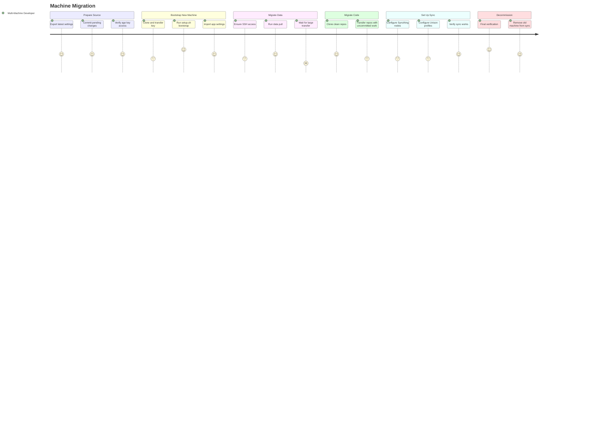

# JOURNEY-003: Machine Migration

## Persona

[The Multi-Machine Developer](../../persona/(PERSONA-001)-The-Multi-Machine-Developer/(PERSONA-001)-The-Multi-Machine-Developer.md) — replacing an old machine with a new one and needs to transfer both the workstation config *and* user data (documents, code, media).

## Goal

Migrate from an existing machine to a new one with full fidelity: same tools, same configs, same data, same working state — including uncommitted code changes and in-progress work.

## Steps / Stages

### 1. Prepare the source machine

Before touching the new machine, the developer ensures the source machine's repo is up to date.

- **Export latest settings** — Run `make export-all` on the source machine to capture current iTerm2, Raycast, Stream Deck, and OpenIn preferences. Commit and push.
- **Commit any pending changes** — Ensure the repo has no uncommitted config changes.
- **Verify age key access** — Confirm the age key is available for transfer.

### 2. Bootstrap the new machine

Standard fresh machine bootstrap (see [JOURNEY-001](../../journey/(JOURNEY-001)-Fresh-Machine-Bootstrap/(JOURNEY-001)-Fresh-Machine-Bootstrap.md)).

- **Clone, transfer key, run setup.sh** — The developer follows the same fresh bootstrap flow.
- **Select all phases** — For a full migration, all phases are typically selected.
- **Import settings** — iTerm2, Raycast, Stream Deck settings restored from the repo.

### 3. Migrate user data

The developer uses the TUI's data migration screen or `make data-pull` to bulk-copy user data from the source machine.

- **Ensure SSH access** — The new machine must be able to SSH into the source machine. Typically both machines are on the same network.
- **Select source hostname** — Enter the source machine's hostname or IP in the TUI.
- **Initiate data pull** — `make data-pull SOURCE=<hostname>` runs rsync over SSH for Documents, Pictures, Music, Videos, and Downloads.
- **Monitor progress** — The TUI shows transfer progress. Large data sets (media libraries) can take hours on local network.

**Pain point: Large data transfer time.** Transferring hundreds of gigabytes of user data over even a fast local network takes significant time. There's no resume-on-disconnect — if the transfer is interrupted, the developer must restart.

### 4. Migrate code repositories

User data migration covers documents and media, but git repositories need special handling — they may have uncommitted changes, branches, stashes, and worktrees.

- **Clone fresh repos** — For repos with no local-only work, `git clone` on the new machine is cleanest.
- **Transfer repos with uncommitted work** — For repos with in-progress changes, the developer uses Unison or manual rsync to preserve the working tree state.
- **Repos outside `~/code/`** — Since SPEC-002 and SPEC-003, repos in user data folders (e.g., `~/Documents/HouseOps/`) are auto-detected by the git-repo-scanner and registered for wsync sync. These repos are already excluded from Syncthing and covered by wsync's multi-directory support. The developer no longer needs to manually track them — once the scanner runs on the new machine, repos discovered in Syncthing folders are automatically added to wsync coverage.

**Pain point: Uncommitted work transfer.** There's no single `make code-pull SOURCE=<host>` command that discovers all repos on the source machine, detects which have uncommitted changes, and transfers them preserving working tree state. The developer must identify repos individually. _(Partially addressed by SPEC-002/003 for repos in user data folders — they sync automatically via wsync once both machines are running.)_

### 5. Set up ongoing sync

Once the initial migration is complete, the developer configures Syncthing and Unison for ongoing synchronization.

- **Configure Syncthing** — Add the new machine as a node in the hub-and-spoke topology. Share user data folders.
- **Configure Unison** — Set up bidirectional code sync profiles for repos that span multiple machines.
- **Verify sync** — Create a test file on one machine, confirm it appears on the other.

### 6. Decommission the old machine

After verifying everything works on the new machine, the developer can retire the old one.

- **Final verification** — Run `make verify` on the new machine. Confirm all tools, dotfiles, and data are present.
- **Remove old machine from Syncthing** — Drop the old node from the topology.
- **Wipe or repurpose** — The old machine can be wiped cleanly; nothing critical lives only on it.

## Pain points summary

| Stage | Pain point | Severity | Owning artifact | Opportunity |
|-------|-----------|----------|-----------------|-------------|
| Migrate Data | Large data transfers take hours with no resume-on-disconnect | Frustrated | STORY-004 (EPIC-002) | rsync `--partial` flags for resumable transfers |
| Migrate Code | No unified way to transfer repos with uncommitted work | Frustrated | STORY-005 (EPIC-002) | `make code-pull SOURCE=<host>` with repo discovery and dirty-state detection |

## Opportunities

- **Resumable data pull:** Adding `--partial --partial-dir=.rsync-partial` to the rsync command would allow interrupted transfers to resume from where they left off.
- **Code repo discovery:** A script that scans `~/code/` on the source machine, reports which repos have uncommitted changes, and offers clone-or-sync per repo would eliminate the manual triage step.
- **Syncthing-first migration:** Instead of rsync, the developer could add the new machine to Syncthing and let it sync naturally. Slower for initial transfer but inherently resumable and doesn't require SSH.
- **Migration checklist:** A TUI screen that tracks migration progress (data: done, code: 3/7 repos, sync: configured, verification: passed) would reduce the cognitive load of a multi-step migration.

### Lifecycle

| Phase | Date | Commit | Notes |
|-------|------|--------|-------|
| Validated | 2026-02-27 | cf207f8 | Based on actual macOS-to-macOS and Linux-to-Linux migrations |
