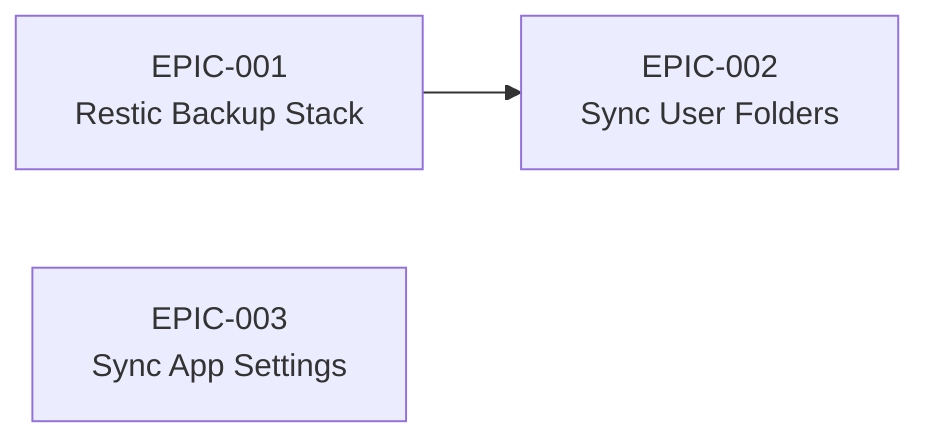

# Roadmap — VISION-001: Workstation as Code

Organizes child Epics into a sequenced plan. Updated to reflect actual Epic phases as work progresses.

## Sequencing

EPIC-001 (Restic Backup Stack) comes first: backups are a safety net that should be in place before enabling sync workflows that move data between machines.

EPIC-003 (Sync App Settings) is independent of EPIC-001/002 — it operates on a different layer (dotfiles/config vs data/backups) and can run in parallel.

## Epic Status

| Epic | Goal | Phase | Dependencies |
|------|------|-------|-------------|
| [EPIC-001](../../epic/(EPIC-001)-Restic-Backup-Stack/(EPIC-001)-Restic-Backup-Stack.md) | Automated encrypted backups to B2 with 365-day retention | Proposed | SPIKE-003 (Active) |
| [EPIC-002](../../epic/(EPIC-002)-Sync-User-Folders/(EPIC-002)-Sync-User-Folders.md) | Continuous sync of user data and code across workstations | Proposed | SPIKE-006 (Active), EPIC-001 |
| [EPIC-003](../../epic/(EPIC-003)-Sync-App-Settings/(EPIC-003)-Sync-App-Settings.md) | Expand Stow + Ansible to cover all roles with capturable settings | Proposed | SPIKE-005 (Active), ADR-004 (Proposed) |

## Future Work

The following capabilities are anticipated but not yet scoped as Epics:

- **Cross-platform action bindings** — SPIKE-004 + ADR-003 are in progress; Epic TBD
- ~~App settings sync expansion~~ — now tracked as [EPIC-003](../../epic/(EPIC-003)-Sync-App-Settings/(EPIC-003)-Sync-App-Settings.md)
- **Multi-workstation fleet management** — Inventory-driven convergence, per-machine phase selection (part of VISION-001 scope expansion)
